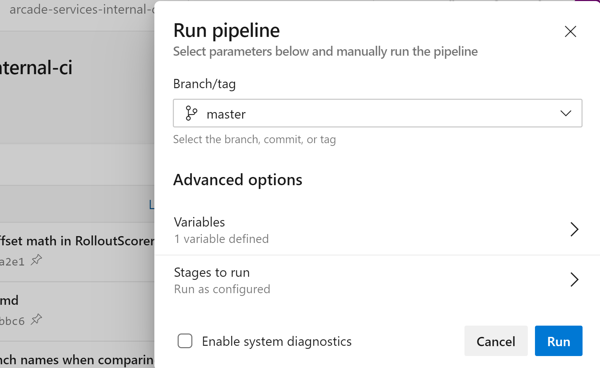

# Arcade Services

## Overview

These are the services that drive several of the tools behind the [Arcade](//github.com/dotnet/arcade) repository

### How to contribute

- How to contribute guide [TBD]

- [Pull requests](https://github.com/dotnet/arcade-services/pulls): [Open](https://github.com/dotnet/arcade-services/pulls?q=is%3Aopen+is%3Apr)/[Closed](https://github.com/dotnet/arcade-services/pulls?q=is%3Apr+is%3Aclosed)

- [Issues](https://github.com/dotnet/arcade/issues)

This project has adopted the [Microsoft Open Source Code of Conduct](https://opensource.microsoft.com/codeofconduct/).  For more information see the [Code of Conduct FAQ](https://opensource.microsoft.com/codeofconduct/faq/) or contact [opencode@microsoft.com](mailto:opencode@microsoft.com) with any additional questions or comments.

Information about Maestro [README.md](src/Maestro/Readme.md)

Please follow our [Validation Process](https://github.com/dotnet/core-eng/blob/master/Documentation/Validation/README.md) for including tests to go with new or changed functionality.

### License

.NET Core (including the Arcade repo) is licensed under the [MIT license](LICENSE.TXT). 

### BARViz Best Practices

#### How to Understand the State of a Build and Channel

Each of the links on the left side bar represent a channel for a product. Clicking on one of these links will load the current build state for a channel. 

The two main states of a channel’s current build are as follows: 

- [Green checkmark] Current build is good. 

- [Yellow bang] There are issues with this build. The message at the top of the build's page will give you more information as to the issue, but most likely is one of the following issues: 
  - The repository is not running the latest version of the Arcade toolset. Older versions of the Arcade toolset are incompatible with determining the state of the build. 
  - Latest builds are failing

While looking at a build, you may notice highlighted (in yellow) dependencies. These denote the dependencies that are an older version than another of the same dependency used in the build. This should help the teams to identify issues with dependency coherency within a build.  

When mousing over a dependency, you may notice icons that show up along the left-hand side of the list. The icon at the top of the column provides help for understanding these icons. These icons are to assist in understanding the hierarchy of the dependency graph and to point out conflicting dependencies within the build.  

#### How to Understand Versions and Hashes Used for a Build

The number at the top of the build's page, next to the URL for the repository, is the current build number of the repository. The link of the hash below the URL will take you to the AzDO repository and the hash referenced so that the user can see all the commits that are a part of the latest build. 

Similarly, each dependency denotes the version of that dependency used and a link to the hash of the latest commit that was contained in the build. 

#### How to Onboard a New Repository

If you would like to see your repository on BARViz, it needs to be published to the Build Asset Registry. Please see the [Darc documentation](https://github.com/dotnet/arcade/blob/master/Documentation/Darc.md).

## Validation Process in dev and int environments

For any non-deployment code changes, the expectation is to have run the tests corresponding to the service locally to confirm that the change works before putting up the PR. The tests for each of the major areas in arcade-services are as below:
- [Maestro](src\Maestro\Tests)
- [Darc](src\Microsoft.DotNet.Darc\tests)

For any deployment changes, the only way to test would be to kick off the [build pipeline](https://dev.azure.com/dnceng/internal/_build?definitionId=252&_a=summary) that deploys the intended service from the dev branch to staging / int environment.

:warning: :sweat: :boom:
**This comes with a significant overhead of a possibility of leaving the int deployments in a broken or hung state, which then would require significant manual effort to undo the damage especially with the Service Fabric Clusters. This process should only be done if and only if absolutely necessary and after obtaining management approval.**

Steps:
- Execute the azurepipeline.yaml targeting dev branch by using run pipeline and selecting the branch

- Once the testing is done, rerun the pipeline for master branch to return the deployment to a last known good.

