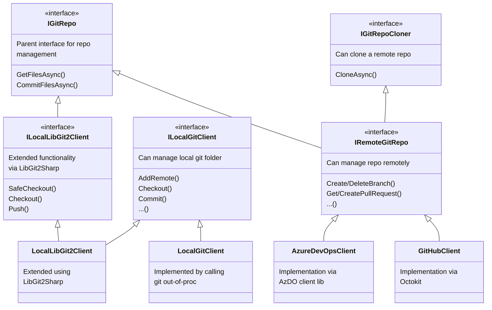

This document describes some of the architecture of the code in `DarcLib`, especially classes for managing git.

### Git clients

The `DarcLib` has several git-related classes which manage either a local git directory or a remote GitHub/AzureDevOps repository. The Maestro service can then open most PRs remotely without having to have to clone the repository whereas the `Darc` tool needs to be able to manage local repositories.

- The local repositories are either managed by calling `git` out-of-proc or by using the `LibGit2Sharp` library.
- The remote repositories are managed via 3rd party client libraries (OctoKit / AzDO clients).
- Other classes then only use `IGitRepo` which is enough for most of the operations (e.g. `DependencyFileManager` can read and change files in a repo without knowing if it's local or remote).

