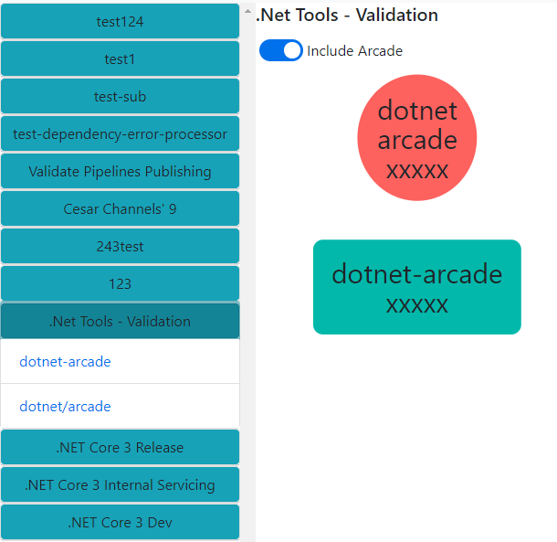
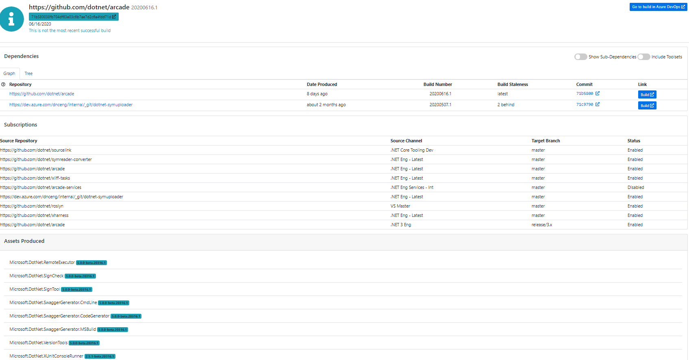

# Maestro++ Scenarios and test coverage

## Overview

This is a list of the business scenarios that Maestro is involved in, and the
automated or manual validation to be performed for those scenarios

## Package Publishing

Maestro is only involved in the insertion of builds into the BAR. As long as
there are no errors when creating builds using the API, the base publishing
scenario will work.

### Automated Tests

Scenario tests for the latest version of the API are available at
https://github.com/dotnet/arcade-services/blob/master/src/Maestro/tests/Scenarios/builds.ps1.
This test creates a build and manipulates its dependencies, so it covers the
scenarios exercised by the publishing infrastructure.

Additionally, unit tests for the 20190116 API version are available at:
https://github.com/dotnet/arcade-services/blob/master/src/Maestro/Maestro.Web.Tests/BuildController20190116Tests.cs.

## Manual testing
We don't have scenario or unit tests for older versions of this controller/API.
Making POST requests to:
* https://maestro-int.westus2.cloudapp.azure.com/api/builds/15357?api-version=2018-07-16
* https://maestro-int.westus2.cloudapp.azure.com/api/builds/15357?api-version=2019-01-16

with the following body:
```json
{
  "repository": "https://github.com/dotnet/arcade",
  "branch": "riarenas/test",
  "commit": "12345",
  "buildNumber": "12",
  "assets": [
    {
      "name": "testasset",
      "version": "1.0",
      "nonShipping": true,
      "locations": [
        {
          "location": "alocation",
          "type": 0
        }
      ]
    }
  ],
  "dependencies": [
  ]
}
```

Tests that it's possible to publish a build with assets to the BAR for versions
not covered by the automated scenario tests, and closes the gap that automation
doesn't cover.

## Dependency Flow

Most of the Maestro APIs are involved in Dependency flow. This is also the area
with the most scenario test coverage.

The main scenarios for dependency flow are:

* Query builds and assets from the BAR
* CRUD (Create, Read, Update, Delete):
  * Channels
  * Default channels
  * Subscriptions
  * Repository Policies
  * Goal build times
* Applying dependency updates and opening / Managing Pull requests

### Automated Testing

The scenario tests available in
<https://github.com/dotnet/arcade-services/tree/master/src/Maestro/tests/Scenarios>
and exercise the following paths:

* Build querying
* CRUD (Creation, Reading, Updating, Deletion) of channels
* CRUD of Default channels
* CRUD for repository policies to a repository + branch combination
* CRUD + triggering of subscriptions
* Applying dependency updates / opening / merging pull requests
* Applying batched dependency updates from multiple repositories
* Applying dependency updates from Arcade, which include changes to the
  eng/common folder
* Adding / removing a build to/from a channel after the build has been created

**NOTE:** These tests only validate the latest API version. This fact is
somewhat mitigated by the fact that Darc is the main mechanism to manipulate
these APIs. More coverage should be added to older API versions, but they are
not critical for any known scenarios, so I believe the existing tests are enough
to cover the dependency flow scenario.

## BarViz Scenarios

Barviz is used to query interesting data from the BAR, specifically, the main
scenarios include visualizing:

* Available channels in the BAR, along with a list of repositories that have
  published to a channel
* Flow graph for a channel
* Details of a particular build, including its dependency graph

### Automated Testing

We have some automated UI testing in
<https://github.com/dotnet/arcade-services/tree/master/src/Maestro/maestro-angular/e2e>,
but it has failed to detect the latest issues we've seen.

We have also started adding unit tests for data retrieval from the Database that
should be expanded as new regressions are encountered:
https://github.com/dotnet/arcade-services/tree/master/src/Maestro/Maestro.Web.Tests

### Manual Testing

The brunt of Barviz validation is performed manually:

* Go through the website making sure no errors are rendered when browsing
  channels / repositories and builds:

  * Channels view: Clicking on a channel should show a dropdown of repositories
    that have published to that channel, along with a graph of those
    repositories:

    

  * Builds view: Clicking on a repository from the dropdown should show the
    information for the latest build of that repository in the channel, along
    with tables for its dependencies, subscriptions, and assets produced:

    

  Some example URLs to visit:
  * https://maestro-int.westus2.cloudapp.azure.com/9/graph
  * https://maestro-int.westus2.cloudapp.azure.com/9/https:%2F%2Fdev.azure.com%2Fdnceng%2Finternal%2F_git%2Fdotnet-arcade/latest/graph

If any errors are visible, the browser console should reveal which API is
returning the errors: Making GET requests to these APIs will also reveal any
problem with the queries that Barviz uses:

#### Build Details

* https://maestro-int.westus2.cloudapp.azure.com/api/builds/15357?api-version=2018-07-16
* https://maestro-int.westus2.cloudapp.azure.com/api/builds/15357?api-version=2019-01-16
* https://maestro-int.westus2.cloudapp.azure.com/api/builds/15357?api-version=2020-02-20

#### Build graph

* https://maestro-int.westus2.cloudapp.azure.com/api/builds/15357/graph?api-version=2018-07-16
* https://maestro-int.westus2.cloudapp.azure.com/api/builds/15357/graph?api-version=2019-01-16
* https://maestro-int.westus2.cloudapp.azure.com/api/builds/15357/graph?api-version=2020-02-20

#### Channel graph

* https://maestro-int.westus2.cloudapp.azure.com/api/channels/9/graph?api-version=2018-07-16
* https://maestro-int.westus2.cloudapp.azure.com/api/channels/9/graph?api-version=2019-01-16
* https://maestro-int.westus2.cloudapp.azure.com/api/channels/9/graph?api-version=2020-02-20

### Channel Repositories
* https://maestro-int.westus2.cloudapp.azure.com/api/channels/9/repositories?api-version=2018-07-16
* https://maestro-int.westus2.cloudapp.azure.com/api/channels/9/repositories?api-version=2019-01-16
* https://maestro-int.westus2.cloudapp.azure.com/api/channels/9/repositories?api-version=2020-02-20

### Additional usage of the Maestro API (Unknown Scenarios)

The Arcade publishing templates, Darc and Barviz are the clients that we own
that talk to the Maestro API, but there are adhoc queries that other clients may
use, where we don't have enough test coverage. Especially when it comes to older
versions of the APIs.
