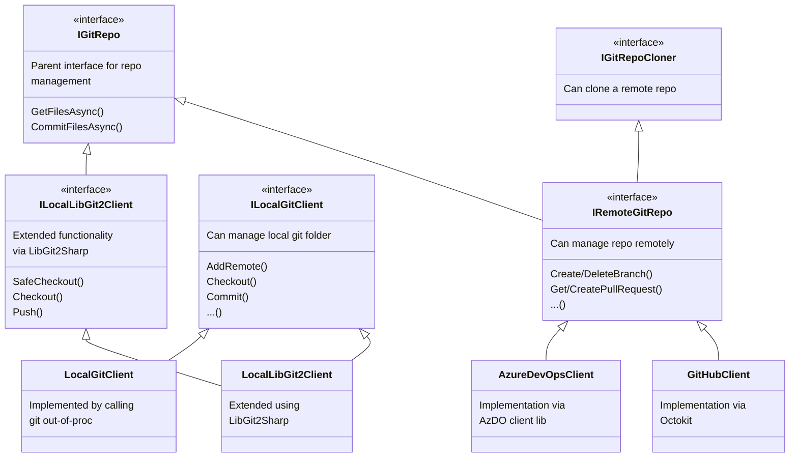

This document describes some of the architecture of the code in `DarcLib`, especially classes for managing git.

### Git clients

```mermaid
classDiagram
    IGitRepo <|-- ILocalLibGit2Client
    ILocalGitClient <|-- LocalGitClient
    ILocalGitClient <|-- LocalLibGit2Client
    ILocalLibGit2Client <|-- LocalLibGit2Client
    IGitRepo <|-- IRemoteGitRepo
    IGitRepoCloner <|-- IRemoteGitRepo
    IRemoteGitRepo <|-- AzureDevOpsClient
    IRemoteGitRepo <|-- GitHubClient

    class IGitRepo {
        <<interface>>
        Parent interface for repo
        management
        GetFilesAsync()
        CommitFilesAsync()
    }
    class ILocalLibGit2Client {
        <<interface>>
        Extended functionality
        via LibGit2Sharp
        SafeCheckout()
        Checkout()
        Push()
    }

    class ILocalGitClient {
        <<interface>>
        Can manage local git folder
        AddRemote()
        Checkout()
        Commit()
        ...()
    }

    class LocalGitClient {
        Implemented by calling
        git out-of-proc
    }

    class LocalLibGit2Client {
        Extended using
        LibGit2Sharp
    }

    class IGitRepoCloner {
        <<interface>>
        Can clone a remote repo
    }

    class IRemoteGitRepo {
        <<interface>>
        Can manage repo remotely
        Create/DeleteBranch()
        Get/CreatePullRequest()
        ...()
    }

    class GitHubClient {
        Implementation via
        Octokit
    }

    class AzureDevOpsClient {
        Implementation via
        AzDO client lib
    }
```