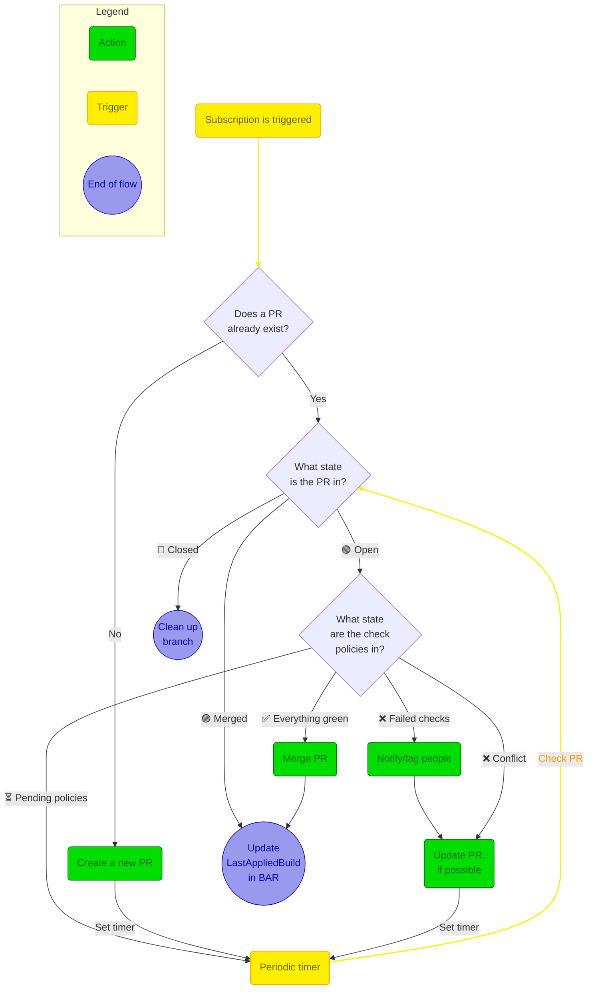

# Dependency update flow

Following diagram shows how a dependency update PR progresses from opening to merging. The flow is triggered when a subscription is triggered by a user or on a schedule.

```mermaid
flowchart
    SubscriptionTrigger(Subscription is triggered)
    Exist{Does a PR<br />already exist?}
    State{What state<br />is the PR in?}
    PolicyState{What state<br />are the check<br />policies in?}
    Create(Create a new PR)
    CleanUp((Clean up<br />branch))
    TagPeople(Notify/tag people)
    UpdatePR(Update PR,<br />if possible)
    MergePR(Merge PR)
    UpdateLastBuild((Update<br />LastAppliedBuild<br />in BAR))
    Timer(Periodic timer)

    Exist--Yes-->State
    Exist--No -->Create
    SubscriptionTrigger-->Exist

    State--🟢 Open-->PolicyState
    State--🟣 Merged-->UpdateLastBuild
    State--🔴 Closed-->CleanUp

    PolicyState--✅ Everything green-->MergePR
    MergePR-->UpdateLastBuild
    PolicyState--❌ Failed checks-->TagPeople
    TagPeople-->UpdatePR
    %% Cannot update
    PolicyState--⏳ Pending policies-->Timer
    %% Can update
    PolicyState--❌ Conflict-->UpdatePR
    Timer--Check PR-->State
    Create--Set timer-->Timer
    UpdatePR--Set timer-->Timer

subgraph Legend
    MaestroAction(Action)
    ExternalImpulse(Trigger)
    EndOfFlow((End of flow))
end

classDef Action fill:#00DD00,stroke:#006600,stroke-width:1px,color:#006600
classDef End fill:#9999EE,stroke:#0000AA,stroke-width:1px,color:#0000AA
classDef External fill:#FFEE00,stroke:#FF9900,stroke-width:1px,color:#666600
class Create,TagPeople,NoAction,UpdatePR,MergePR,MaestroAction Action
class UpdateLastBuild,CleanUp,EndOfFlow End
class SubscriptionTrigger,Timer,ExternalImpulse External
linkStyle 2,12 stroke-width:2px,fill:none,stroke:#FFEE00,color:#FF9900
```
